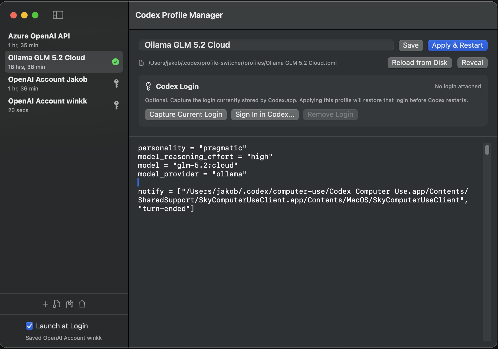

# Codex Profile Switcher

Codex Profile Switcher 是一個 macOS 選單列工具，用來在多組 Codex 設定之間快速切換。它可以管理不同的 ChatGPT/OpenAI 帳號登入狀態，也可以切換 Azure OpenAI、Ollama 或其他相容後端的 API provider profile。

此工具會把 profile 快照儲存在 `~/.codex/profile-switcher/profiles`，套用 profile 時會寫入 `~/.codex/config.toml`，再重新啟動 Codex。

> 這是非官方工具，未受 OpenAI 關聯、背書或贊助。

## 安裝

建議透過 Homebrew 安裝：

```sh
brew tap JakobStadlhuber/codex-profile-switcher https://github.com/JakobStadlhuber/Codex-Profile-Switcher && brew trust JakobStadlhuber/codex-profile-switcher && brew install --cask codex-profile-switcher
```

目前 release 尚未簽署，因此 personal tap 會在安裝後移除 macOS quarantine 屬性。未來若改為 Developer ID 簽署並完成 notarization，就不再需要這個 workaround。

## 畫面

選單列 profile 切換：


Profile 管理視窗：



## 功能

- 在多個 Codex ChatGPT/OpenAI 帳號登入狀態之間切換。
- 在 Azure OpenAI、Ollama 或其他相容 provider 設定之間切換。
- 使用 SwiftUI 管理、編輯、複製與刪除 profile。
- 從目前的 `~/.codex/config.toml` 建立 profile。
- 選擇性地為 profile 綁定檔案式 Codex 登入快照。
- 套用 profile 前自動備份 `~/.codex/config.toml`。
- 可從選單列切換是否登入後自動啟動。

## Profile 檔案

Profile 是一般 TOML 檔，儲存在：

```text
~/.codex/profile-switcher/profiles
```

檔名會作為顯示名稱。常見命名範例：

```text
OpenAI Account.toml
Azure OpenAI API.toml
Ollama GLM 5.2 Cloud.toml
```

套用 profile 時，程式會把該 TOML 內容寫入：

```text
~/.codex/config.toml
```

Profile TOML、套用後的 `config.toml`、設定備份檔與登入快照都會以私人檔案權限寫入，避免其他本機使用者讀取。

## 登入切換

若要把 Codex 登入狀態綁定到 profile，需要先讓 Codex 使用檔案式 credential storage：

```toml
cli_auth_credentials_store = "file"
```

Codex 會把目前登入狀態儲存在：

```text
~/.codex/auth.json
```

在 Profile Manager 中選擇 profile 後，按下 `Capture Current Login` 即可把目前登入狀態保存為該 profile 的登入快照。保存位置如下：

```text
~/.codex/profile-switcher/auth
```

之後套用該 profile 時，程式會先備份目前的 `auth.json`，再還原該 profile 的登入快照並重新啟動 Codex。

## 安全注意事項

- 登入快照含有 Codex access token，請視同密碼處理。
- Profile TOML 通常是 provider 設定，但仍可能包含私有 endpoint、組織資訊或使用者自行填入的敏感值。
- 不建議把 `~/.codex/profile-switcher` 內容提交到版本控制。
- 刪除含登入快照的 profile 會一併刪除該快照；程式會先要求確認。

## 從原始碼建置

使用 Xcode 開啟 `Codex Profile Switcher.xcodeproj`，並執行 `CodexProfileSwitcher` scheme。

常用 Makefile 指令：

```sh
make help
make build-unsigned
make test-unsigned
make clean
```

直接使用 `xcodebuild`：

```sh
xcodebuild -project "Codex Profile Switcher.xcodeproj" -scheme CodexProfileSwitcher -configuration Debug build
```

若本機沒有專案簽章憑證，可使用：

```sh
xcodebuild -project "Codex Profile Switcher.xcodeproj" -scheme CodexProfileSwitcher -configuration Debug CODE_SIGNING_ALLOWED=NO build
```

## 測試

測試使用 XCTest，位於 `CodexProfileSwitcherTests/`。

```sh
make test-unsigned
```

目前測試涵蓋 profile 檔案權限、重新命名後的識別碼穩定性，以及連續套用 profile 時的備份檔名唯一性。

## License

MIT License. See [LICENSE](LICENSE).
