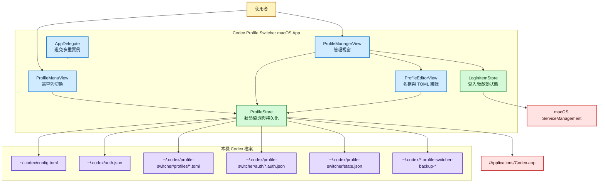
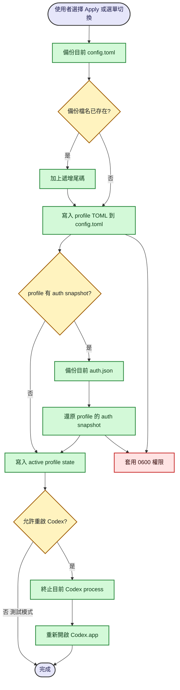
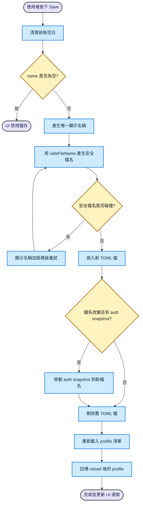
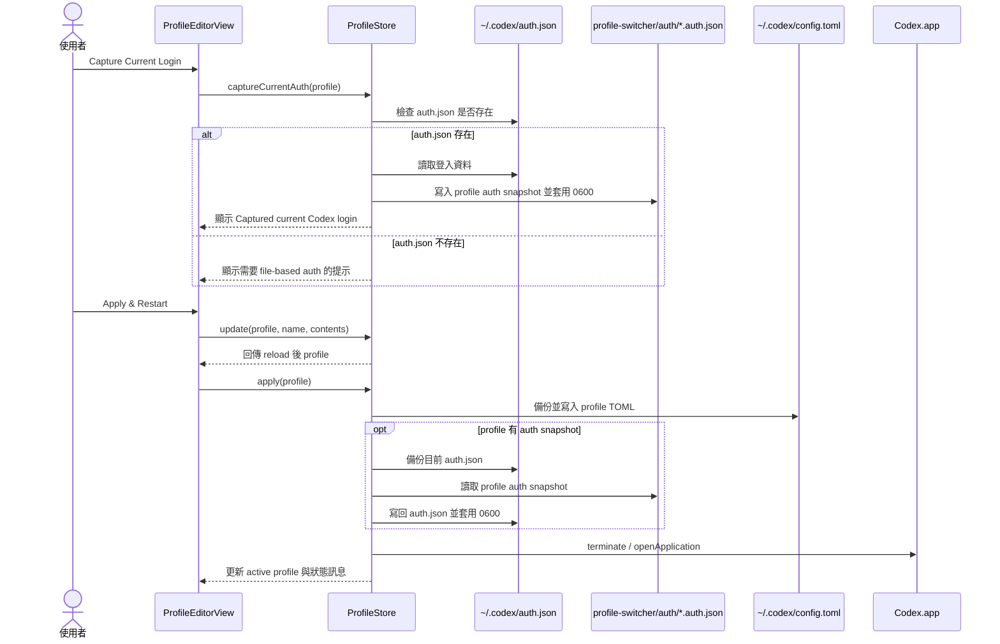
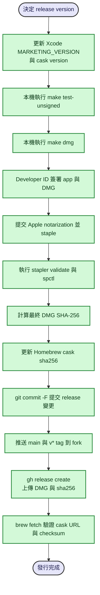

# Codex Profile Switcher 架構與流程圖

本文件用 Mermaid 描述 Codex Profile Switcher 的主要架構、使用者操作流程、設定檔持久化邏輯，以及 release 自動化流程。文字說明請搭配 [應用程式說明.md](./應用程式說明.md) 閱讀。

## 整體架構

## Profile 套用流程

## Profile 編輯與重新命名流程

## 登入快照捕捉與還原 Sequence

## Release 與 Homebrew cask 更新流程

## 閱讀建議

- 想理解程式碼責任分界：先看「整體架構」。
- 想修改套用 profile 行為：先看「Profile 套用流程」與 `ProfileStore.apply(_:)`。
- 想修改重新命名或檔名規則：先看「Profile 編輯與重新命名流程」。
- 想維護登入切換：先看「登入快照捕捉與還原 Sequence」。
- 想修改發行流程：先看「Release 與 Homebrew cask 更新流程」。
